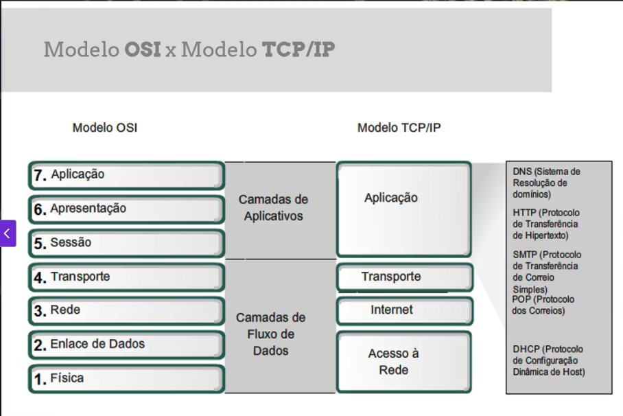
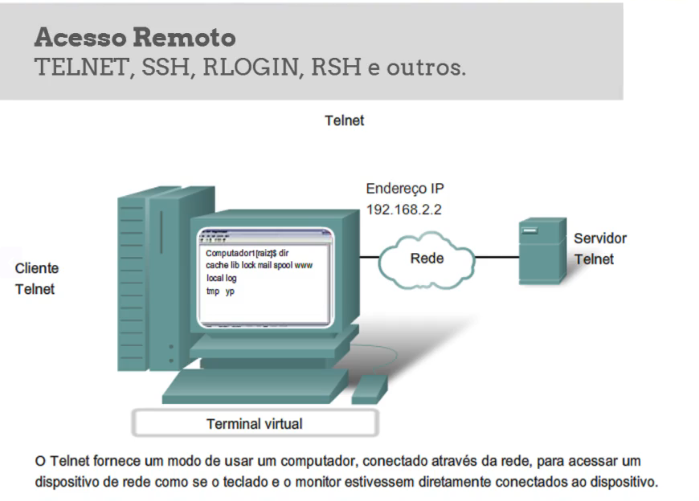
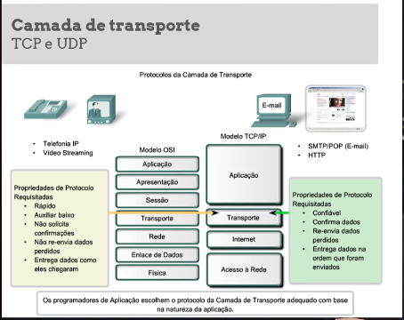
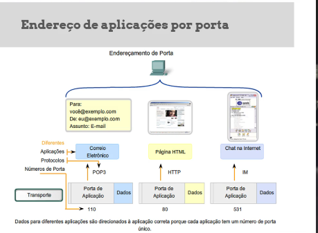
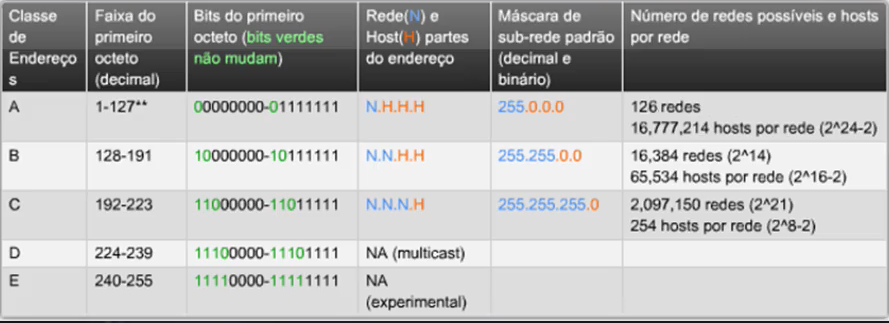

# Fundamentos

### Modelo OSI x Modelo TCP/IP
Hoje trabalhamos com o TCP/IP

### TCP/IP
Aplicação
Transporte 
Internet
Acesso a Rede

  
Modelos de Protocolos de Rede

### DNS (Fundamentos)
Serviço que faz tradução de endereços para nomes
www.cisco.com -> 192.168.219.25

ataques de spufing

### HTTP | HTTPS

Usado para acessar a internet o HTTP -> 
utiliza a porta 80
o https usa a porta 443
é um protocolo de hyper texto

### Acesso Remoto

Camada de aplicação - 
Permitir acessar um computador remotamente 
  

## Camada de Transporte
  


### TCP - Protocolo confiavel
Apesar de não ser rapido ele tem ferramentas para retrinsmição de pacotes 

### UDP - Protocolo não confiavel
não estabelece conexão, muito mais rapido, focado mais em streaming 

  

a porta é associada a um serviço
um serviço pode ter mais de uma porta

tanto o TCP quanto UDP tem um número especifico de portas
0 a 1023
1024 a 49151
porta 

UDP é muito mais veloz, e não faz conexao, só entrega a informação
serviços é como um datagrama


-----
## PARTE 2
Endereçamento de Rede

enderço IP é um enderço logico para acessar informação

IPV4 
32 Bits
na qual separamos os Bits para decimal

porção de rede ou host muito grandes

classe A = 
classe B = mais redes proporcional a maquina 


unicast - endereço fixo de uma maquina
broadcast - endereço de repetição para todas as maquinas
multicast - grupo de informação para x dispositivos

*endereço público e privados*

público = endereço que você recebe da internet

privada = faixas privadas estão dentro de uma rede na qual vão ser propagadas dentro de uma rede

IPV6 - Notação Hexadecimal
MAC - Endereço físico

-----
Endereço Físico 

Endereço fisíco da placa de rede - Hexadecimal os 6 primeiross são o fabricante
 
protocolo ARP
switchs comuns só entendem endereço fisíco na qual ele permite que voce conecte a partir de broadcast uma conexão cache ARP


-------
# Linux

root@kali:
nome e hostname

limpar tela = clear
pwd = listar onde estou
ls = listar conteudo da pasta
rm (nome do arquivo) = apaga o arquivo
ls -l = exibe colunas extras, mostra o tipo do arquivo, quais as permissões
mkdir = cria um diretorio
cd .. = sai do diretorio
vim arquivo.txt = vim cria o arquivo no editor de texto vim
nano arquivo.txt = cria o arquivo utilizando o edito nano
cat = olha o arquivo sem entrar nele
head -3 {nome do arquivo} =  mostra as 3 primeiras linhas
tail -3 {nome do arquivo} = mostra as ultimas 3 linhas
cat {nome do arquivo} | more = pausa até encerrar
cat {nome do arquivo} | less = mostra devagar
cat {nome do arquivo} | grep {palavra} = filtra somente pelas linhas com a palavra definida
echo {valor a ser inserido} >> {nome do arquivo} = uma nova linha 
```
> = apago tudo que tem no arquivo e deixo somente o que vai ser inserido
>> = insiro ao final do arquivo
```
ifconfig = mostra configurações de endereço ip da placa de rede
interface ethernet ou wlan
ifconfig {nome da interface} {endereço ip} 192.168.1.107 netmask 255.255.255.0
who = todas as pessoas logadas no sistema
whoami = mostra qual meu user
ps = lista processos na memoria do usuario
{comando} --help = ajuda
man {comando} = mostra o manual
ps -e | grep ssh = mostra somente os processos do ssh