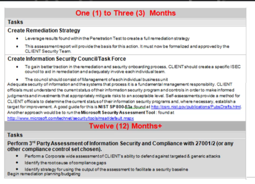

# Como aprender a realizar um Teste de Invasão (PenTest) completo através de diversos exemplos práticos

### Tipos de Teste de Penetração -- Uma visão aprofundada

1. **Black Box**  
   No teste de caixa preta, o profissional de segurança realiza o teste sem ter nenhum conhecimento prévio sobre o alvo. Isso significa que ele não sabe nada sobre a infraestrutura da empresa, serviços em execução ou qualquer outro detalhe relevante. Esse é o tipo de teste mais desafiador e o mais realizado, pois simula uma invasão real por um atacante externo.

2. **Gray Box**  
   O teste de caixa cinza é uma abordagem intermediária. O pentester tem algum conhecimento limitado sobre a organização, mas não tem acesso completo aos seus sistemas. Normalmente, isso representa a visão de um atacante interno com privilégios limitados. Essa abordagem é útil para simular ataques realizados por funcionários ou ex-funcionários da organização.

3. **White Box**  
   O teste de caixa branca é o mais abrangente, onde o pentester tem total conhecimento do alvo, incluindo detalhes da infraestrutura e códigos-fonte (quando aplicável). Esse teste simula um cenário onde um atacante possui privilégios administrativos ou está agindo como um colaborador com acesso completo ao sistema. Isso permite identificar vulnerabilidades que não seriam facilmente descobertas por abordagens externas.

### Fases de um Teste de Penetração

A metodologia de PenTest pode variar conforme a certificação ou o tipo de teste realizado, mas, em geral, segue as fases abaixo:

1. **Reconhecimento (Reconnaissance)**  
   A primeira fase de um PenTest envolve a coleta de informações sobre o alvo. O objetivo é descobrir o máximo possível sobre a infraestrutura do alvo sem ser detectado. Isso inclui informações sobre domínios, servidores, endereços IP, dados públicos de funcionários, redes sociais, etc. Ferramentas como *whois*, *dnsdumpster* e *theHarvester* podem ser úteis para essa coleta.

   **Objetivos:**  
   - Identificar subdomínios e servidores.
   - Buscar por informações de exposição pública (leaks de dados, expostos em redes sociais, etc).
   - Mapear redes e serviços.

2. **Varredura (Scanning)**  
   Nessa fase, o pentester começa a analisar ativamente a rede e sistemas identificados durante o reconhecimento. Ele busca identificar portas abertas, serviços em execução e vulnerabilidades conhecidas. Ferramentas como *Nmap*, *Nessus* e *OpenVAS* são frequentemente usadas para realizar varreduras de IPs e serviços.

   **Objetivos:**  
   - Identificar serviços ativos e suas versões.
   - Determinar possíveis vulnerabilidades nos serviços encontrados.
   - Mapear possíveis entradas para explorar.

3. **Ganhando o Acesso (Gaining Access)**  
   Uma vez que as vulnerabilidades são identificadas, o próximo passo é explorar essas falhas para obter acesso aos sistemas. Isso pode ser feito por meio de ataques como *brute force*, *phishing*, *SQL injection* ou *exploit de software*. A eficácia dessa fase depende da qualidade da coleta de informações e varredura feitas nas fases anteriores.

   **Objetivos:**  
   - Obter acesso a sistemas críticos.
   - Explorar falhas para obter privilégios elevados.
   - Comprometer um sistema ou rede.

4. **Mantendo o Acesso (Maintaining Access)**  
   Após obter acesso, o pentester pode tentar manter o controle sobre o sistema para realizar mais testes ou simular a persistência de um invasor. Isso pode ser feito através da instalação de backdoors, criação de novos usuários com privilégios elevados ou agendamento de processos maliciosos.

   **Objetivos:**  
   - Criar pontos de acesso persistentes.
   - Avaliar a dificuldade de remoção de rastros ou backdoors.
   - Explorar a rede internamente para movimentação lateral.

5. **Cobrir os Rastros (Covering Tracks)**  
   Nesta fase, o objetivo é minimizar a detecção do ataque, apagando logs ou alterando configurações de segurança. Isso simula o comportamento de um atacante real tentando evitar a detecção por parte da equipe de segurança. Embora essa etapa seja importante em cenários reais de teste, é importante que o pentester seja transparente na documentação de como as evidências foram manipuladas.

   **Objetivos:**  
   - Apagar ou modificar logs de eventos.
   - Ocultar a origem do ataque (através de proxies, VPNs, etc).
   - Remover ferramentas de ataque.

### Termo de Responsabilidade e Confidencialidade (NDA)

Antes de iniciar qualquer teste de penetração, é fundamental estabelecer um acordo de confidencialidade com o cliente, geralmente em forma de um **NDA (Non-Disclosure Agreement)**. Este documento é essencial para garantir que o escopo do teste, as responsabilidades de cada parte e as informações sensíveis sejam claramente definidas.

- **Escopo:** Define claramente o que será testado, quais sistemas estão incluídos e quaisquer limitações de horário ou interação com pessoal da organização.
- **Limites:** Estabelece os limites do teste, garantindo que os pentesters não ultrapassem certos sistemas ou realizem ações que possam causar danos significativos.
- **Planos de Comunicação:** Especifica os responsáveis pela comunicação, quem será notificado em caso de descoberta de vulnerabilidades críticas e quais ações devem ser tomadas imediatamente.

### Relatórios de Penetração

Um relatório bem elaborado é uma parte crítica de qualquer PenTest, pois fornece aos stakeholders uma visão clara sobre as descobertas do teste e como elas podem ser corrigidas.

1. **Sumário Executivo:**  
   O sumário executivo é direcionado aos gestores e executivos da organização. Ele contém um resumo não técnico das descobertas mais importantes, incluindo uma classificação das vulnerabilidades encontradas e recomendações gerais de correção.

     
   Classificação das vulnerabilidades encontradas.

     
   Origem dos problemas com suas porcentagens, explicando as principais falhas.

2. **Relatório Técnico:**  
   O relatório técnico é direcionado à equipe de segurança e fornece detalhes sobre as vulnerabilidades encontradas, como foram exploradas, e como corrigi-las. Ele inclui capturas de tela, detalhes técnicos e scripts usados durante o processo de teste.

     
   Tarefas para que o time de segurança possa realizar a correção das falhas.

   *Nota: O pentester geralmente não resolve os problemas diretamente, mas age como consultor, fornecendo as informações necessárias para que a equipe de segurança tome as ações corretivas.*

     
   Passo a passo detalhado para a correção das vulnerabilidades.

---

### Guia de Estudo para Teste de Penetração

Se você deseja aprender PenTest de forma eficiente, siga esse guia de estudo que combina teoria, prática e certificações reconhecidas no mercado:

1. **Fundamentos de Redes e Sistemas Operacionais**  
   - **Estudo de Redes:** Aprenda sobre TCP/IP, DNS, HTTP/HTTPS, NAT, firewalls, roteadores, VPNs e proxies.
   - **Sistemas Operacionais:** Familiarize-se com Windows, Linux (principalmente distribuições como Kali Linux) e seus sistemas de segurança.

2. **Ferramentas Essenciais para Pentesters**  
   - *Nmap* (varredura de redes e portas)
   - *Metasploit* (framework de exploração)
   - *Wireshark* (análise de pacotes)
   - *Burp Suite* (teste de segurança de aplicativos web)
   - *John the Ripper* (quebra de senhas)
   - *Hydra* (força bruta de senhas)
   - *Nikto* (scan de vulnerabilidades em servidores web)

3. **Desenvolvimento de Habilidades Práticas**  
   - **Plataformas de Treinamento:** Utilize plataformas como Hack The Box, TryHackMe e PentesterLab para praticar com desafios práticos.
   - **Captura de Bandeira (CTF):** Participar de competições CTF ajuda a melhorar suas habilidades em hacking e resolução de problemas em tempo real.

4. **Certificações Importantes**  
   - **OSCP (Offensive Security Certified Professional):** Uma das certificações mais reconhecidas para pentesters. Requer habilidades práticas e testes de penetração reais.
   - **CEH (Certified Ethical Hacker):** Focada na prática de segurança ofensiva, cobre uma variedade de ferramentas e técnicas.
   - **CISSP (Certified Information Systems Security Professional):** Focada na segurança da informação, sendo mais estratégica e voltada para líderes de segurança.

5. **Estudos de Caso e Blogs**  
   - **Blogs de Segurança:** Acompanhe blogs como o *PentesterLab*, *SecurityWeek* e *SANS Internet Storm Center* para se manter atualizado sobre novas vulnerabilidades e técnicas de ataque.
   - **Estudos de Caso:** Analisar ataques reais, como o *WannaCry* e *Stuxnet*, pode proporcionar insights valiosos sobre a defesa contra ameaças.

6. **Prática e Documentação**  
   - **Ambientes de Testes:** Monte um ambiente de laboratório seguro utilizando máquinas virtuais (ex. VirtualBox ou VMware) para praticar técnicas sem comprometer sistemas reais.
   - **Documentação:** Sempre documente suas descobertas e práticas, pois o relatório técnico é uma habilidade essencial de comunicação no PenTest.

---

### Referências

- [Pentest Standard](http://www.pentest-standard.org)
- [OWASP (Open Web Application Security Project)](https://owasp.org/)
- [Kali Linux Documentation](https://www.kali.org/docs/)
- [Hack The Box](https://www.hackthebox.eu/)
- [TryHackMe](https://tryhackme.com/)
- [Metasploit Unleashed](https://www.offensive-security.com/metasploit-unleashed/)

Este guia de estudo oferece uma base sólida para quem deseja aprender PenTest, abrangendo os conceitos principais, ferramentas e certificações necessárias para avançar na carreira de segurança ofensiva.
