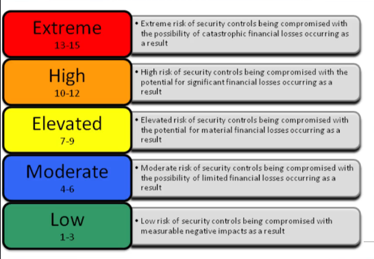
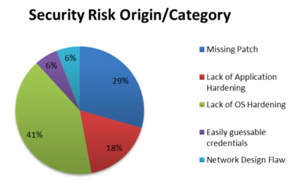
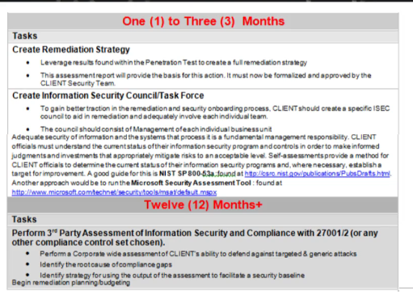
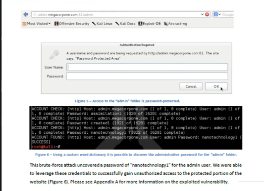

# Como aprender a realizar um Teste de invasão (PenTest) completo através de diversos exemplos práticos

### Tipos de Penetration Test -- APROFUNDAR (MUITO ABSTRATO)

- Black Box
    Teste de sistema remoto, sem nenhum tipo de conhecimento sobre o alvo, logo não sabemos nada sobre a empresa, site e afins
    Pesquisa extensa e mais realizadas

- Gray Box
    Visão entre departamentos, mostrar o que alguem interno com conhecimento parcial consiga realizar

- White Box
    Teste com total conhecimento do alvo, mostra como exemplo um adm de empresa consegue realizar com os poderes dele pode fazer

### Fases do Penetration Test 

A visão muda conforme a certificação (abstração geral sera explicada)

- RECONHECIMENTO (Informações sobre o domínio, informação basica de usuário)
- VARREDURA (Informações que o reconhecimento trouxe, ex: faixa de endereço IP e usa tecnicas de varreduras IP e portas para saber quantos serviços tem ali, identificando recursos e vulnerabilidades)
- GANHANDO O ACESSO (Preciso que as 2 primeiras fases sejam bem feitas para que eu possa identificar e tem seus metodos como brute force e exploits para ganhar acesso, a um serviço ou afins)
- MANTENDO O ACESSO (Mantem o acesso, pode ser por backdoor, colocar um serviço ou agendar o processo)
- COBRIR RASTROS (Desde esconder o endereço IP de origem, apagar logs de acessos)

### Termo de Responsabildade e Confidencialidade

- NDA (Non Disclosure Agreement)
    - ESCOPO
        - O que será testado, quando e se vamos ter contato com pessoas ou não

    - LIMITES
        - vamos definir limites de escopo de engenharia de pessoas

    - PLANOS DE COMUNICAÇÃO
        - Quem vamos reportar? tem cargo para isso? 

### Relatorio 
Sumário Executivo - resumo para os executivos sem termos tecnicos 

classificação das vulnerabilidades

origem dos problemas com suas porcentagens

Relatório Técnico - Vai mostrar passo a passo os detalhes do que foi acessado com telas e com sugestões de como resolver

Tarefas para que o time de segurança possa fazer a correção

<!-- como nota: o pentester não resolve o problema normalmente age como consultor -->

Relatorio Tecnico

Passo a Passo para correção e como foi realizado o teste!

--- 
### Refs
www.pentest-standard.org
